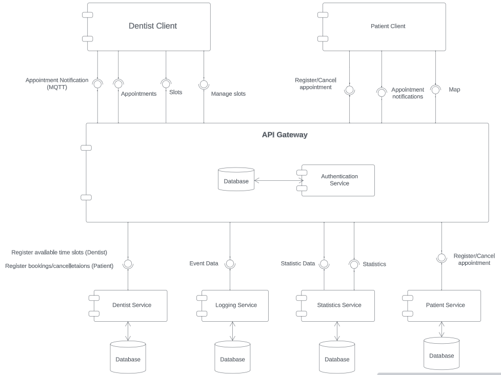

# This is the appendix!
Here you will find all diagrams and documentation artifacts, with all versions of the artifact.

## Initial Component Diagram V1 (01-11-2023)

## Updated Component Diagram V2 (10-11-2023)
We decided to merge the dentist and patient service into one booking service as it covers appointments which is the main responsibility of both microservices

