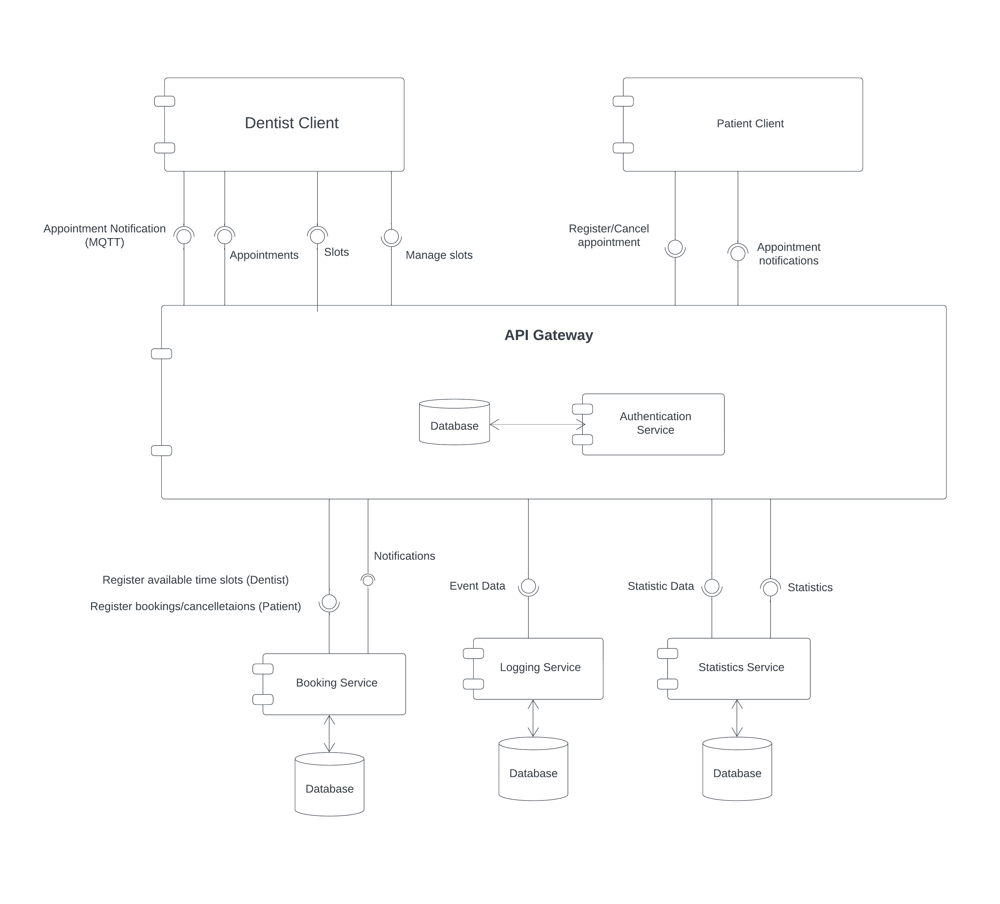
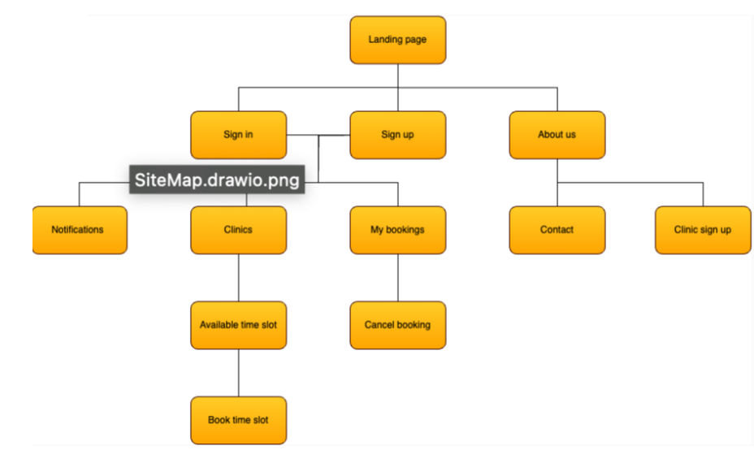

# Group 20 - Distributed Systems [Project title here]

## Components
[Patient Client](https://git.chalmers.se/courses/dit355/2023/student-teams/dit356-2023-20/group-20-distributed-systems-patient-client)

[Dentist Client](https://git.chalmers.se/courses/dit355/2023/student-teams/dit356-2023-20/group-20-distributed-systems-dentist-client)

[API Gateway](https://git.chalmers.se/courses/dit355/2023/student-teams/dit356-2023-20/group-20-distributed-systems-api-gateway)

## Component Diagram

## ER Diagram

## Context Diagram

## Site Map

## Use Case Diagram

## Video
Link here
