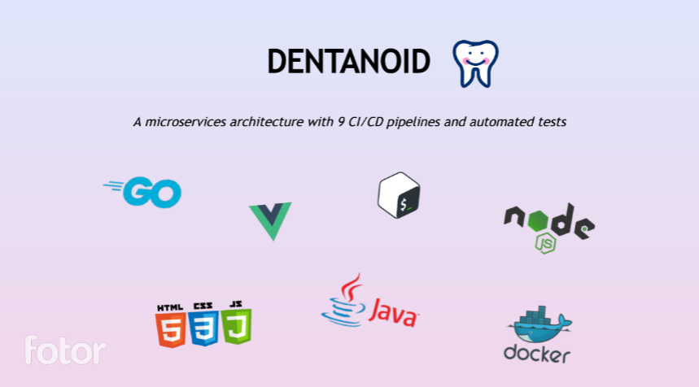
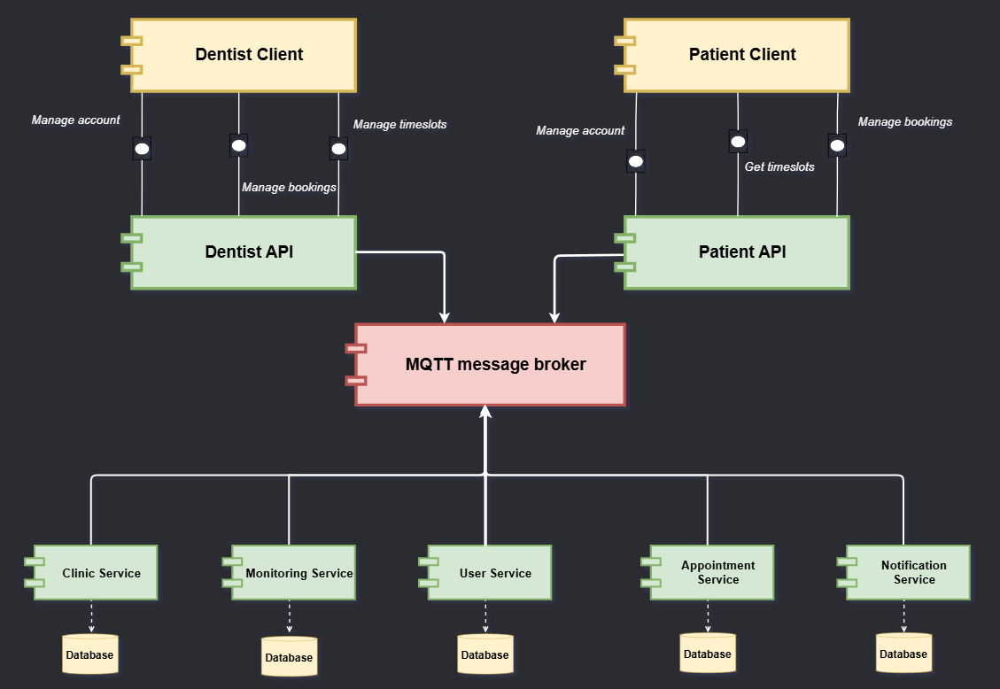
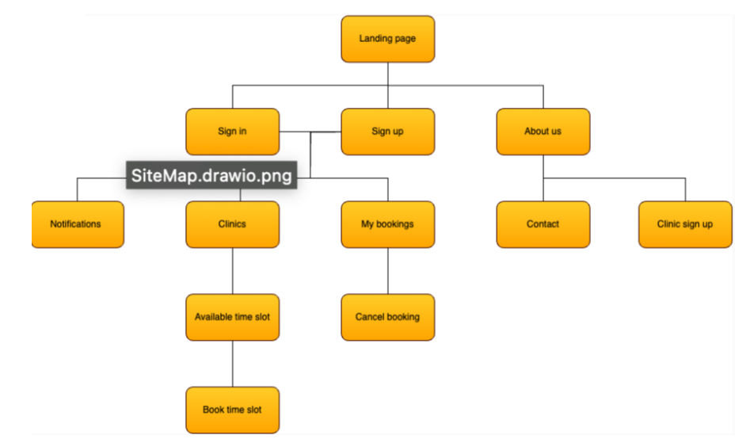

# Dentanoid - Distributed Systems

## Components

**Frontend Clients:**

- [Patient Client](https://github.com/Dentanoid/Patient-Client)

- [Dentist Client](https://github.com/Dentanoid/Dentist-Client)

**REST APIs:**

- [Patient API](https://github.com/Dentanoid/Patient-API)

- [Dentist API](https://github.com/Dentanoid/Dentist-API)

**Backend Services:**

- [User Service](https://github.com/Dentanoid/User-Service)

- [Appointment Service](https://github.com/Dentanoid/Appointment-Service-Go)

- [Clinic Service](https://github.com/Dentanoid/Clinic-Service)

- [Monitoring service](https://github.com/Dentanoid/Monitoring-Service)

- [Notification Service](https://github.com/Dentanoid/Notification-Service)

**Scaled Deployment:**

- [Scaled Deployment](https://github.com/Dentanoid/Scaled-Deployment)

## System Architecture

## ER Diagram

## Context Diagram

## Site Map

## Use Case Diagram

## Commercial Video

